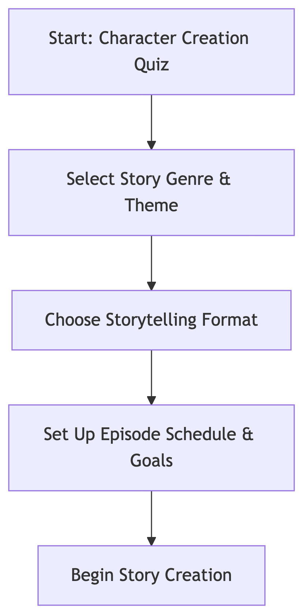
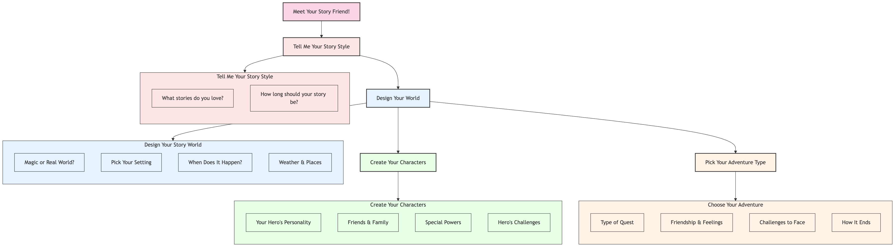
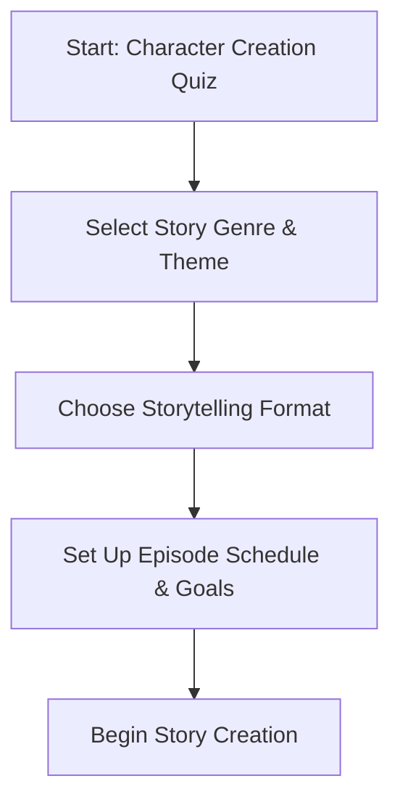
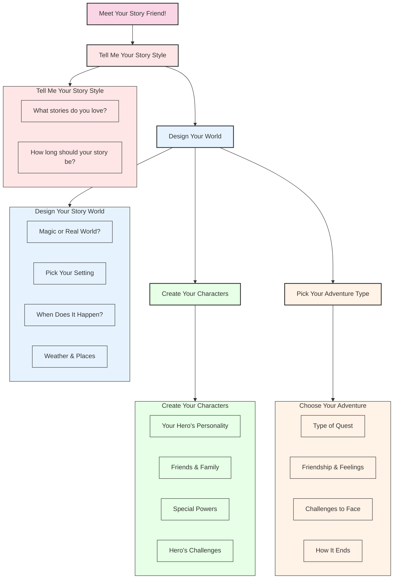

# Kid Book Builder: Onboarding

## Child User Workflow: Onboarding & Story Initiation (Mermaid Diagram)

1. **Onboarding & Story Initiation**

   - Complete fun character creation quiz
   - Select story genre and theme
   - Choose storytelling format (fantasy, adventure, etc.)
   - Set up episode schedule and goals

   - 

2. **Story Creation Process**
   - Record story narration through guided prompts
   - Add details about characters and settings
   - Review and listen to recorded segments
   - Receive suggestions for story improvement
   - Save progress and continue later

## Character Creation Quiz Details

### Overview

The character creation quiz is an interactive voice chatbot experience designed to engage children in a natural conversation that helps shape their storytelling journey. The chatbot, acting as a friendly story guide, asks questions and responds to the child's answers to help develop their story's foundation.

### Voice Chatbot Interaction

- Friendly, age-appropriate AI personality that adapts its language to the child's age
- Natural conversation flow with follow-up questions based on previous answers
- Voice recognition optimized for children's speech patterns
- Option to repeat or rephrase questions if the child's response isn't clear

### Core Question Categories

1. **Tell Me Your Story Style**

   - What stories do you love? (favorite genres and themes)
   - How long should your story be? (short stories, chapter books)

2. **Design Your Story World**

   - Magic or Real World? (choose your world type)
   - Pick Your Setting (kingdoms, space, underwater, etc.)
   - When Does It Happen? (past, present, future)
   - Weather & Places (environment details)

3. **Create Your Characters**

   - Your Hero's Personality (traits and qualities)
   - Friends & Family (supporting characters)
   - Special Powers (abilities and skills)
   - Hero's Challenges (fears and obstacles)

4. **Choose Your Adventure**
   - Type of Quest (mystery, discovery, journey)
   - Friendship & Feelings (emotional elements)
   - Challenges to Face (puzzles, battles, problems)
   - How It Ends (story outcome)

### Output: Story Guide

The quiz generates a personalized story guide that includes:

- Character profile with personality traits and abilities
- Recommended story genres and themes
- Suggested plot elements and story arcs
- Visual representation of the story worlda
- List of potential supporting characters
- Story structure recommendations based on age and preferences

### Adaptive Features

- Adjusts question complexity based on child's age and responses
- Offers encouragement and positive reinforcement
- Provides examples and suggestions when children need help
- Allows for story guide modifications as preferences evolve

## Appendix: Mermaid Code

### Child User Workflow: Onboarding & Story Initialization

### Character Creation Quiz Workflow

